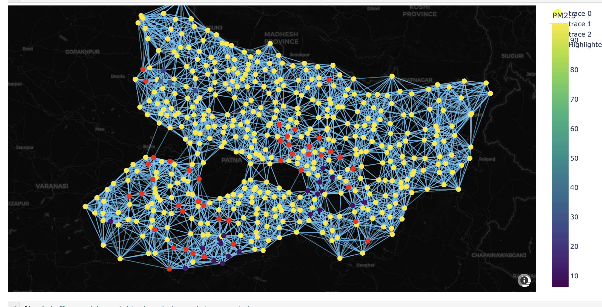
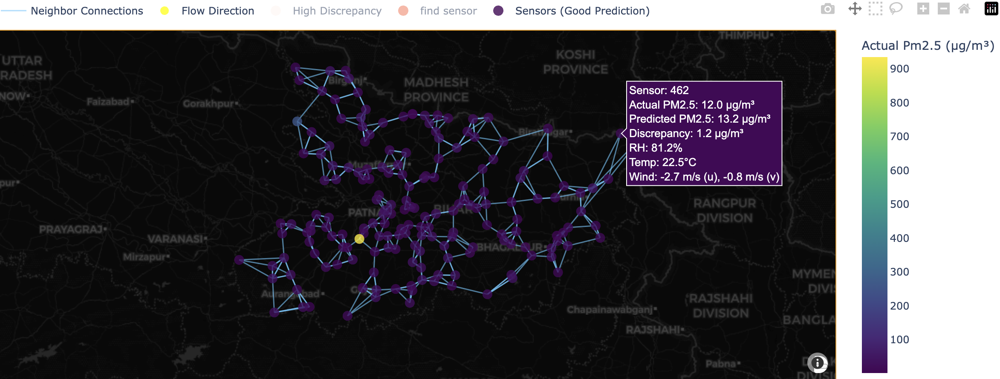
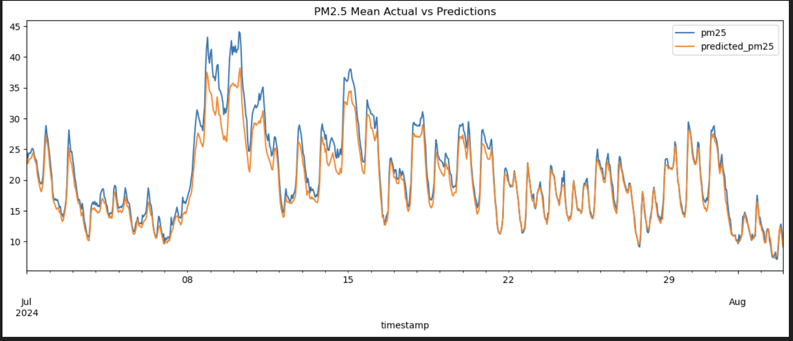

# Spatiotemporal Forecasting and Kriging-Based Interpolation of PM2.5

This repository contains work from the **Centre of Excellence ATMAN, National Aerosol Facility, IIT Kanpur**, focused on predicting **PM2.5 concentrations at unknown locations** using a range of statistical, machine learning, and graph-based methods.  

Currently, the repository includes code for **spatial interpolation and Kriging methods**. Upcoming modules will integrate advanced forecasting approaches including **XGBoost, IGNNK, and graph neural network–based models**.
We are also integrating advanced spatiotemporal forecasting approaches leveraging Large Language Models (LLMs) with PEFT/LoRA and Graph Neural Networks (GNNs) for next-hour and multi-hour PM2.5 predictions.

---

##  Project Overview

Air quality monitoring networks in India have limited spatial coverage. To better understand and forecast pollution exposure, we aim to predict **PM2.5 at unmonitored locations** using:

- **Kriging & Universal Kriging**  
  - Classical geostatistical interpolation techniques that leverage spatial correlation.  
  - Variogram modeling with spherical, exponential, and Gaussian structures.  
  - External drift inclusion using meteorological parameters such as temperature, wind components (`u10`, `v10`).  

- **Machine Learning Approaches**  
  - **XGBoost regression** for fast, flexible learning from sensor and meteorological data.  
  - **Graph-based methods** including **IGNNK** (Inductive Graph Neural Network for Kriging) that exploit the sensor network as a graph for more robust spatial interpolation.  

- **Spatiotemporal Forecasting**
-  Exploring Foundational Models like ST-LLM- (work ongoing)
-  Using ST-LLM (Spatiotemporal Large Language Model- distilGPT2 for memory contarined enviroment) with PEFT (LoRA) fine-tuning to predict PM2.5 sequences.
- Integrates graph-based sensor embeddings via GNNs to capture spatial correlations dynamically.
- Recursive multi-hour forecasting implemented, allowing predictions beyond the last observed timestamp.
- Incorporates meteorological cyclic features (hourly, monthly) and sensor metadata (latitude, longitude).

---

##  Visualizations

### 1. Sensor Grid Layout
Below is an example plot of the **sensor locations and generated grid points** used for interpolation.  
In the notebooks, this can be interacted with as a **live object** for exploring specific sensor points and their neighborhoods.  




---

### 2. Pollution Animation (GIF)
We generate animated spatial maps showing **predicted PM2.5 concentrations across Bihar** on a **500m × 500m grid**.  
This GIF illustrates **pollution dynamics and spatial gradients** predicted using XGBoost Regressor based and Nearest Neighbours logic interpolation on Forecasted values at stations using GRU based forecaster:  


---

### 3. Prediction Trends
The following figure shows how the models learn **temporal cycles** of PM2.5 — capturing **hourly variations** (diurnal cycles) and **monthly trends**.  



---

##  Current Status

-  Interpolation with Kriging methods implemented.  
-  Variogram modeling & universal kriging with external drift.  
-  Pollution animation GIF generated.  
-  Integration with XGBoost models.  
-  Implementation of IGNNK and graph-based spatiotemporal interpolation models.
-  Forecasting Models with ST-LLM, PEFT on GPT2, GNNs and SARIMA and other paproaches in progress

---

## 📂 Repository Structure
```
│── ST-LLM+GNN+GPT2 finetune-forecasting/
│   │── inference.py          # Sliding-window & extended recursive forecasts
│   │── training_script.py    # ST-LLM + GNN model training
│   │── stllm.py              # ST-LLMWithGNN model definition
│   │── models/               # Saved checkpoints, scalers, graph data
│── Spatio-Temporal-Kriging-Interpolation/
│   │── bihar_pollution2.gif # Animation of pollution spread over Bihar
│   │── graph_sage_gnn.ipynb # Graph Neural Network (GraphSAGE) approach and XGBOost Approach also towards the end
│   │── kriging_methods_plots.ipynb # Kriging-based interpolation methods
│   │── trial1/ # Folder containing static Bihar pollution maps
│   │── XGB_based_model_plots_and_hotspot_detection.ipynb # XGBoost predictions & hotspot detection
│── ST-LLM + PEFT- Forecasting/
│   │── inference.py          # Sliding-window & extended recursive forecasts
│   │── training_stllm_custom.py    # ST-LLM + PEFT model training
│   │── models/               # Saved checkpoints, scalers, graph data
│   │   │── st_llm_model.py              # ST-LLMWithGNN model definition

---
```

## About

This project is part of ongoing research at the  
**Centre of Excellence ATMAN, National Aerosol Facility, IIT Kanpur**.  
We aim to build robust frameworks for **high-resolution air quality mapping and forecasting** to support public health and policy decisions.
